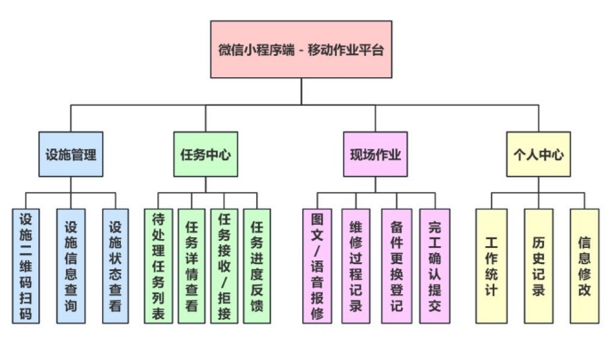
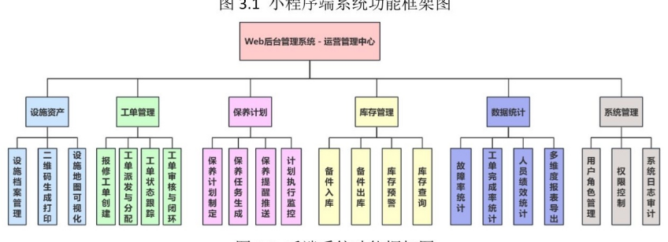

项目图片

# 给 Windsurf 的任务说明（最终版）：港航设施维修保养系统（Spring Boot + Vue3 + Element Plus + uni-app）

> 目的：让 Cursor 根据本文档生成**计划书 / 任务拆解 / 开发排期 / 页面-接口-数据表清单 / 验收标准 / 测试方案**。
> 技术栈硬约束：
> 
> - 后端：**Spring Boot**（Java）
> - 后台管理：**Vue 3 + Element Plus**
> - 微信端：**uni-app**（编译到微信小程序）
> - 数据：MySQL（可选 Redis 作为缓存/Token/热点数据）
>   关键功能约束：**删除“设施地图可视化功能”**（不加载地图、不展示 marker、不做路线规划/地理编码、不调用任何外部地图 API）。
>   允许：提交记录时采集 GPS 经纬度与时间戳用于“防作假与审计”，但只以字段/表格展示，不做地图渲染。

---

## 1. 项目一句话定义

建设一个面向港航设施（港口/航道设施）的维修与保养数字化系统，采用：

- **uni-app 微信小程序端**：服务一线人员（巡检/维修/保养执行者），用于扫码识别设施、上报故障、接收任务、现场记录、上传证据、提交结果。
- **Vue3 + Element Plus Web 后台**：服务管理者（管理员/调度/主管），用于设施资产建档、二维码管理、工单派发与监管、保养计划制定与自动生成任务、库存备件管理、统计分析。
- **Spring Boot 后端服务**：统一 RESTful API，提供鉴权、业务流程、状态机、定时任务、通知、文件上传与存储等能力。

最终交付：可运行可演示的系统原型 + 配套文档（用于论文：需求/设计/实现/测试）。

---

## 2. 要解决的核心问题（业务痛点）

1. **流程线下**：报修—派工—执行—验收靠电话/纸质/Excel，响应慢。
2. **过程不透明**：管理者无法实时掌握工单进度、执行质量与人员工作量。
3. **数据不可沉淀**：设施维修历史、保养记录、备件消耗分散，无法形成全生命周期档案。
4. **现场真实性不足**：记录可能补填/造假，缺少可审计证据。

系统目标：实现“线上闭环 + 留痕可追溯 + 数据沉淀 + 可统计分析”。

---

## 3. 明确范围（必须做 / 禁止做）

### 3.1 必做范围（MVP 必须闭环）

- 设施资产管理：建档、维护、二维码生成与绑定、历史可查
- 工单闭环：报修/上报 → 创建 → 派单 → 接单 → 处理 → 提交 → 验收 → 归档
- 保养计划：制定周期/模板 → 到期自动生成保养工单 → 派单执行 → 归档
- 库存备件：入库/出库、预警、与工单消耗关联（可先做简化版）
- 统计分析：至少能展示 2~3 个关键指标（完成率、平均修复时长、故障高发设施等）

### 3.2 禁止项：设施地图可视化（必须删除）

不得实现或依赖：

- 地图底图加载（腾讯/高德/百度/Google 等）
- 地图点位展示（marker）、聚合、热力图
- 路线规划、导航、路径推荐
- 逆/正地理编码
- 围栏、轨迹、到达路径等
- 任何外部地图 API 的付费调用

### 3.3 允许项：GPS 字段采集（不画地图）

uni-app 端可在提交记录时采集经纬度并保存，用于审计/防作假；后台仅表格/字段展示。

---

## 4. 角色与权限（RBAC 必须落地）

最少三类角色：

1. **管理员/调度（后台）**
   
   - 设施建档、二维码生成
   - 创建/派发/转派工单
   - 验收、归档
   - 用户、角色、权限管理
   - 统计报表、库存预警
2. **维修/保养执行者（微信端）**
   
   - 接收派单、查看详情
   - 到场扫码确认设施
   - 填写处理过程与结果
   - 上传图片证据、提交完成
   - 查看个人历史与绩效统计
3. **巡检/上报者（微信端，可与执行者同人）**
   
   - 扫码查档
   - 上报故障/隐患（生成维修工单或待派工记录）

权限模型建议：RBAC（用户-角色-权限）+ 简化数据权限（只看自己/本部门）。

---

## 5. 业务流程必须清晰（工单状态机）

### 5.1 工单类型（至少两类）

- **维修工单**：故障/报修触发
- **保养工单**：保养计划到期自动生成

### 5.2 状态机（建议最小 6 态）

1. 待派发
2. 已派发（待接单）
3. 已接单（处理中）
4. 待验收（已提交）
5. 已完成（已验收）
6. 已归档（不可编辑）

必须定义：

- 谁能把状态从 A 变到 B（角色/权限）
- 进入某状态需要哪些必填字段（例如“提交完成”至少 1 张图片证据 + 文字说明 + 时间戳 + 经纬度字段）

---

## 6. uni-app 微信端（必须达成的体验目标）

定位：轻量、聚焦现场、少步骤完成关键动作。

必须支持：

- 登录/绑定身份
- 扫码识别设施 → 展示档案摘要与历史入口
- 任务中心：待办/处理中/待提交/已完成列表
- 工单详情：流程节点、操作按钮（接单/开始处理/提交）
- 现场提交：文字 + 图片上传（可选语音）+ 自动记录时间戳 + 经纬度字段
- 我的：个人信息、历史记录、统计（完成数量、平均耗时等）

注意：不做地图页面，不展示点位地图。

---

## 7. Vue3 + Element Plus 后台（必须达成的管理目标）

必须支持：

- 设施管理：列表/新增/编辑/停用/详情/二维码生成与下载
- 工单管理：创建、派单、转派、催办（可选）、验收、归档、全流程追踪
- 保养计划：计划模板、周期配置、到期生成机制（与后端定时任务配合）
- 库存管理：备件台账、入库/出库、库存预警、工单关联消耗
- 统计分析：关键指标看板 + 报表列表（可导出可选）

展示 GPS：仅字段/表格方式（经纬度、提交时间、提交人等）。

---

## 8. Spring Boot 后端必须提供的关键能力

1. **统一鉴权**
   
   - 微信端：通过 uni-app 获取 code → 后端换取 openid → 绑定系统用户 → 发放 Token（JWT）
   - 后台端：账号密码登录（同 JWT），可做统一的权限拦截
2. **统一 RESTful API**
   
   - API 按模块分组：auth、user、facility、workorder、maintenancePlan、inventory、stats、file
   - 统一返回结构、错误码、分页规范
3. **文件上传与证据管理**
   
   - 支持图片上传、访问控制
   - 文件与工单记录强绑定（可追溯）
4. **定时任务（保养计划自动生成工单）**
   
   - 定时扫描计划（每天/每小时）
   - 幂等：同一计划同一周期不能重复生成
   - 生成工单后通知相关人员（或进入待派发队列）
5. **防作假数据留痕**
   
   - 保存：设施ID、扫码时间、提交时间（服务器）、经纬度、附件列表、提交人
   - 后台可做阈值校验逻辑（只做距离计算，不画地图；若无设施坐标可先不校验）

---

## 9. 验收与演示（必须可跑通的两条闭环）

### 9.1 维修闭环演示（必有）

1) 微信端扫码设施 → 上报故障/报修
2) 后台生成工单并派发
3) 微信端接单 → 到场扫码 → 填写记录 → 上传图片 → 提交
4) 后台验收 → 完成归档 → 设施历史中可查

### 9.2 保养闭环演示（必有）

1) 后台创建保养计划（周期/模板/检查项）
2) 后端定时任务自动生成保养工单
3) 派发 → 微信端执行提交 → 后台验收归档

### 9.3 真实性证明（必有）

每条现场提交记录必须包含：

- 设施关联（扫码绑定）
- 服务器时间戳
- 至少 1 张图片证据
- 经纬度字段（仅保存与展示，不画地图）

---

## 10. 测试与质量要求（Windsurf 计划书要包含）

- 功能测试：两条闭环全流程、状态机约束、必填校验
- 权限测试：不同角色菜单/接口访问控制
- 接口测试：鉴权、分页、文件上传、幂等性
- 稳定性：弱网/上传失败重试（可选）
- 回归测试：关键流程修改后必须回归闭环

---

## 11. Cursor 需要输出的内容清单（以“规范开发步骤 → 按步骤自编码 → 等待测试”为目标）

请 Cursor 严格按下面的顺序输出与执行：**先产出可执行开发步骤（带验收点）→ 再按步骤自己写代码实现 → 每完成一个里程碑就停下等待我测试反馈**。

### 11.1 先输出：规范开发步骤（必须非常具体）

输出一个“从 0 到可验收系统”的步骤清单，要求每一步都包含：

- **目标**：这一阶段完成什么
- **涉及端**：后端 / 管理后台 / 微信端（uni-app）
- **任务点**：要写哪些模块/页面/接口/表
- **完成定义（DoD）**：如何判断这一步完成（可运行、可点击、可调用、可演示）
- **自测清单**：Cursor 自己要跑哪些用例/检查点
- **产物**：代码目录、配置、文档（如 README、接口文档、脚本）

> 强制约束：开发步骤中不得出现任何地图可视化、地图组件、外部地图 API 调用（GPS 仅字段保存与展示）。

### 11.2 再输出：里程碑划分（按里程碑推进编码）

把开发步骤划分为若干里程碑（建议 5~8 个），每个里程碑必须：

- 能独立验收（我能启动并验证）
- 覆盖核心业务闭环逐步成型
- 明确“本里程碑不做什么”，避免范围膨胀

### 11.3 然后执行：按里程碑自编码（Cursor 自己动手写完）

在我未要求停止的前提下，Cursor 需要：

- 按里程碑顺序**直接生成代码**（Spring Boot / Vue3+ElementPlus / uni-app）
- 同步生成必要的：
  - 数据库初始化脚本（schema + 基础数据）
  - 配置与启动说明（README）
  - 关键接口说明（简版即可，能调试）
- 每个里程碑结束时必须输出：
  - **启动方式**（后端/前端/小程序分别怎么跑）
  - **我该怎么测**（用例步骤、账号、数据准备方式）
  - **预期结果**（看到什么页面/状态/数据变化）

### 11.4 里程碑结束动作：停止并等待我测试（必须遵守）

每完成一个里程碑后，Cursor 必须：

- 明确提示：`【里程碑 X 已完成，请你开始测试】`
- **停止继续开发**，等待我反馈 bug/改动
- 收到反馈后：
  - 先给出问题定位与修改计划
  - 再提交修复代码
  - 修复完成后再次停下等待我复测

### 11.5 必须包含的“最终验收里程碑”

开发步骤必须保证最终能完成并验收：

- **维修闭环演示**：上报 → 派单 → 接单 → 到场扫码 → 提交图文证据（含时间戳+经纬度字段）→ 后台验收归档 → 历史可查
- **保养闭环演示**：后台建计划 → 定时任务生成保养工单 → 派发执行 → 验收归档
- **RBAC 权限生效**：不同角色菜单与接口权限正确
- **库存最小可用**：入库/出库/预警 + 与工单消耗可关联（可简化）
- **统计最小可用**：至少 2~3 个指标可展示（完成率、平均耗时、故障高发设施等）

### 11.6 交付形态要求（便于我测试）

- 后端：可一键启动（本地配置清晰），API 可用
- 管理后台：可本地启动并连到后端
- uni-app：可运行到微信小程序（或 H5 预览），能完整走通闭环
- 数据：提供 demo 数据与测试账号（管理员/执行者/上报者）
- 文档：最少一份 README（包含环境、启动、测试步骤、里程碑验收方式）

> 再次强调：全流程不得出现“地图可视化”，GPS 仅作为字段记录与审计用途。

---

## 12. 最后硬约束（再次强调，防止 Windsurf 跑偏）

- 不要设计任何“地图可视化页面/地图组件/marker 展示/路线规划”。
- 不要调用任何外部地图 API。
- GPS 只作为字段记录与审计使用。
- 系统核心价值：一物一码扫码识别 + 工单闭环 + 保养计划自动生成工单 + 库存与数据分析 + 防作假留痕。

